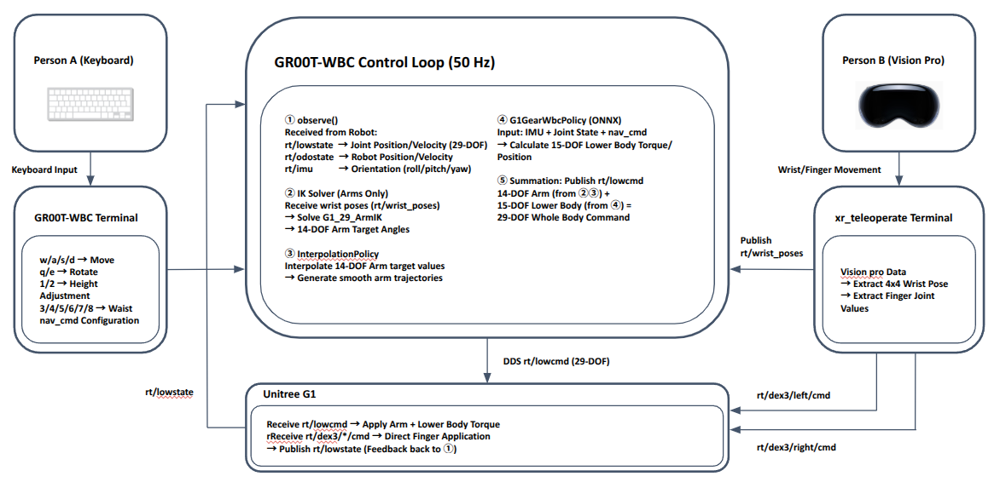

# g1_xr_locomotion

Full-body teleoperation of Unitree G1: XR for arms/hands, GR00T-WBC for lower body.

This project integrates **[xr_teleoperate](https://github.com/unitreerobotics/xr_teleoperate)** (upper body control via XR devices) with **[GR00T-WholeBodyControl](https://github.com/NVIDIA-Omniverse/GR00T-WholeBodyControl)** (lower body locomotion via WBC policy) to achieve full-body teleoperation of the Unitree G1 humanoid robot within **Isaac Sim**.

- **Upper body** (arms + dexterous hands): Controlled in real-time via Apple Vision Pro hand tracking
- **Lower body** (legs + waist): Controlled by NVIDIA GR00T Whole-Body-Control policy with keyboard walking commands
- **Communication**: All three processes coordinate via DDS (CycloneDDS), with no modifications to the core logic of either project

---

## Table of Contents

1. [Architecture Overview](#1-architecture-overview)
2. [Prerequisites](#2-prerequisites)
3. [Installation](#3-installation)
4. [Simulation Deployment](#4-simulation-deployment)
5. [Physical Robot Deployment](#5-physical-robot-deployment)
6. [Voice Control](#6-voice-control)
7. [Data Recording](#7-data-recording)
8. [Technical Details](#8-technical-details)
9. [Repository Structure](#9-repository-structure)
10. [Acknowledgements](#10-acknowledgements)

---

## 1. Architecture Overview

The system runs as **three independent processes** communicating over DDS:



| Process | Conda Env | Role | Controls |
|---------|-----------|------|----------|
| Isaac Sim | `unitree_sim_env` | Physics simulation, camera streaming | Robot simulation (PhysX) |
| GR00T-WBC | `gr00t_wbc_env` | Whole-body locomotion + balance | Legs (12 DOF) + Waist (3 DOF) + Arms (14 DOF) |
| xr_teleoperate | `tv` | XR hand tracking, arm IK, hand retargeting | Arms (14 DOF) + Hands (14 DOF) |

---

## 2. Prerequisites

### Hardware
- **GPU**: NVIDIA RTX GPU (for Isaac Sim, see [system requirements](https://docs.isaacsim.omniverse.nvidia.com/4.5.0/installation/requirements.html))
- **XR Device**: Apple Vision Pro, Meta Quest 3, or PICO 4 Ultra Enterprise
- **Router**: For connecting XR device and host PC to the same network

### Software
- Ubuntu 22.04 (recommended) or 20.04
- [Miniconda](https://docs.conda.io/en/latest/miniconda.html) or Anaconda
- NVIDIA Isaac Sim 4.5.0 (via [Isaac Lab](https://isaac-sim.github.io/IsaacLab/main/source/setup/installation/index.html))
- Git

### Additional System Packages

```bash
# Required for real robot deployment (DDS port forwarding)
sudo apt install socat

# Required for voice control (audio pipeline)
sudo apt install ffmpeg portaudio19-dev

# Required for GR00T-WBC real robot / voice control
# Install ROS 2 Humble: https://docs.ros.org/en/humble/Installation/Ubuntu-Install-Debs.html
```

---

## 3. Installation

### 3.1 Clone this repository

```bash
git clone https://github.com/Kantapia0814/g1_xr_locomotion.git
cd g1_xr_locomotion
```

### 3.2 Run the setup script

The setup script clones `unitree_sim_isaaclab` from [our fork](https://github.com/Kantapia0814/unitree_sim_isaaclab) (all integration patches are pre-applied) and creates conda environments:

```bash
chmod +x setup.sh
./setup.sh
```

> **Note**: `unitree_sim_isaaclab` requires Isaac Lab to be installed first. Follow the [unitree_sim_isaaclab README](https://github.com/unitreerobotics/unitree_sim_isaaclab) for Isaac Lab setup.

### 3.3 Create conda environments and install packages

The `setup.sh` script automatically creates conda environments from the exported `envs/*.yml` files. If you need to create them manually:

```bash
conda env create -f envs/unitree_sim_env.yml
conda env create -f envs/gr00t_wbc_env.yml
conda env create -f envs/tv.yml
```

After environment creation, install editable packages:

#### Environment 1: Isaac Sim (`unitree_sim_env`)

```bash
conda activate unitree_sim_env
# Install Isaac Lab first (see unitree_sim_isaaclab README)
cd unitree_sdk2_python
pip install -e .
```

#### Environment 2: GR00T-WBC (`gr00t_wbc_env`)

```bash
conda activate gr00t_wbc_env
cd GR00T-WholeBodyControl
pip install -e .
cd ../unitree_sdk2_python
pip install -e .

# Voice control dependencies (optional — only needed for --voice flag)
pip install edge-tts faster-whisper openwakeword pyaudio transformers
```

#### Environment 3: xr_teleoperate (`tv`)

```bash
conda activate tv

cd xr_teleoperate/teleop/teleimager
pip install -e . --no-deps

cd ../televuer
pip install -e .

# Generate SSL certificates for XR device connection
# For Pico / Quest:
openssl req -x509 -nodes -days 365 -newkey rsa:2048 -keyout key.pem -out cert.pem

# For Apple Vision Pro (detailed setup):
openssl genrsa -out rootCA.key 2048
openssl req -x509 -new -nodes -key rootCA.key -sha256 -days 365 -out rootCA.pem -subj "/CN=xr-teleoperate"
openssl genrsa -out key.pem 2048
openssl req -new -key key.pem -out server.csr -subj "/CN=localhost"
# Create server_ext.cnf — replace IPs with your own
cat > server_ext.cnf << 'CERTEOF'
subjectAltName = @alt_names
[alt_names]
DNS.1 = localhost
IP.1 = 192.168.123.164
IP.2 = <YOUR_HOST_IP>
CERTEOF
# IP.1 = robot PC2 internal IP (192.168.123.164, fixed by Unitree)
# IP.2 = your host PC IP on the network the XR device connects to
openssl x509 -req -in server.csr -CA rootCA.pem -CAkey rootCA.key \
  -CAcreateserial -out cert.pem -days 365 -sha256 -extfile server_ext.cnf
# Copy rootCA.pem to Apple Vision Pro via AirDrop and install it

# Configure certificate paths
mkdir -p ~/.config/xr_teleoperate/
cp cert.pem key.pem ~/.config/xr_teleoperate/

# Install dex-retargeting
cd ../robot_control/dex-retargeting
pip install -e .

# Install remaining dependencies
cd ../../../
pip install -r requirements.txt

# Install unitree_sdk2_python
cd ../unitree_sdk2_python
pip install -e .
```

---

## 4. Simulation Deployment

### 4.1 Launch Order

All three processes must be started **in order**. Open three separate terminals:

#### Terminal 1: Isaac Sim

```bash
conda activate unitree_sim_env
cd unitree_sim_isaaclab

python sim_main.py \
  --task=Isaac-MinimalGround-G129-Dex3-Wholebody \
  --enable_fullbody_dds \
  --enable_cameras \
  --enable_dex3_dds \
  --device cpu \
  --robot_type g129
```

Wait until the simulation window appears and you see `controller started, start main loop...`.

> **Note**: Click once in the simulation window to activate it.

#### Terminal 2: GR00T-WBC

```bash
conda activate gr00t_wbc_env
cd GR00T-WholeBodyControl

python -m gr00t_wbc.control.main.teleop.run_g1_xr_control_loop
```

Wait until you see `Waiting for arm commands on rt/arm_sdk from xr_teleoperate...`.

**Keyboard controls for walking:**

| Key | Action |
|-----|--------|
| `]` | Activate WBC policy (start balancing) |
| `o` | Deactivate policy |
| `w` / `s` | Move forward / backward |
| `a` / `d` | Strafe left / right |
| `q` / `e` | Rotate left / right |

#### Terminal 3: xr_teleoperate

```bash
conda activate tv
cd xr_teleoperate/teleop

python teleop_hand_and_arm.py \
  --sim \
  --arm=G1_29 \
  --ee=dex3 \
  --img-server-ip=localhost
```

> **Important**: Use `--img-server-ip=localhost` in simulation mode.

### 4.2 Connect XR Device

1. Put on your XR headset and connect to the same Wi-Fi network as the host PC
2. Open a browser and navigate to: `https://<HOST_IP>:8012?ws=wss://<HOST_IP>:8012`
   - Replace `<HOST_IP>` with your host machine's IP (check with `ifconfig`)
   - Accept any SSL certificate warnings
3. Click **Virtual Reality** and allow all prompts
4. Align your arms to the robot's initial pose (arms down at sides)
5. Press **`r`** in Terminal 3 to start teleoperation

### 4.3 Additional Options

```bash
# With data recording
python teleop_hand_and_arm.py --sim --arm=G1_29 --ee=dex3 --img-server-ip=localhost --record

# With controller tracking (instead of hand tracking)
python teleop_hand_and_arm.py --sim --arm=G1_29 --ee=dex3 --img-server-ip=localhost --input-mode=controller

# Headless mode (no GUI on xr_teleoperate side)
python teleop_hand_and_arm.py --sim --arm=G1_29 --ee=dex3 --img-server-ip=localhost --headless
```

### 4.4 Exit

1. Position the robot's arms close to the initial pose
2. Press **`q`** in Terminal 3 (xr_teleoperate)
3. Press `Ctrl+C` in Terminal 2 (GR00T-WBC)
4. Close Isaac Sim

---

## 5. Physical Robot Deployment

> **Note**: Commands below use `~/g1_xr_locomotion` as the repo path. Replace with your actual clone location.

Physical deployment follows the same 3-process architecture with these differences:

### 5.1 Image Service (on Robot PC2)

SSH into the robot's Development Computing Unit (PC2) and start the image server:

```bash
ssh unitree@192.168.123.164
# Password: 123  →  Press Enter (skip ROS prompt)

source ~/venvs/teleimager/bin/activate
cd ~/teleimager
teleimager-server --rs
```

> **Note**: `teleimager` comes pre-installed on the Unitree G1 Development Computing Unit (PC2). The `--rs` flag enables RealSense camera support. Use `--cf` to discover all connected cameras.
>
> **Camera Busy error**: If you get a "camera busy" error, open the **Unitree Explore** tablet app → Device → Service Status → stop `vidio_hub_pc4/1.0.1.1`.

### 5.2 socat Port Forwarding (on Host PC)

Forward the robot's DDS ports to the host PC:

```bash
sudo socat TCP-LISTEN:60001,fork TCP:192.168.123.164:60001
sudo socat TCP-LISTEN:60000,fork TCP:192.168.123.164:60000
```

### 5.3 Launch

#### Terminal 1: GR00T-WBC (on Host PC)

```bash
export LD_LIBRARY_PATH=$CONDA_PREFIX/lib:$LD_LIBRARY_PATH
source /opt/ros/humble/setup.bash
conda activate gr00t_wbc_env
cd ~/g1_xr_locomotion/GR00T-WholeBodyControl

python -m gr00t_wbc.control.main.teleop.run_g1_xr_control_loop \
  --interface real
```

> **Arm Stability**: The GR00T-WBC control loop includes arms in its inner loop with velocity-aware damping and delta clamping. This prevents the arms from dropping or jerking when changing direction — a problem that occurs when arm commands are applied externally without feedback.

#### Terminal 2: xr_teleoperate (on Host PC)

```bash
conda activate tv
cd ~/g1_xr_locomotion/xr_teleoperate/teleop

python teleop_hand_and_arm.py \
  --arm=G1_29 \
  --ee=dex3 \
  --img-server-ip=<YOUR_HOST_IP> \
  --network-interface=<YOUR_INTERFACE> \
  --motion
```

> **Environment-specific values** — replace before running:
> - `<YOUR_HOST_IP>`: Your host PC's IP on the network accessible to the XR device (check with `ip addr`). Example: `192.168.1.13`
> - `<YOUR_INTERFACE>`: Network interface connected to the robot (check with `ip -br link show`). Example: `eno3np0`

> **Warning**:
> 1. Keep a safe distance from the robot at all times.
> 2. Ensure the robot is in control mode (via R3 remote) before using `--motion`.
> 3. Align arms to the initial pose before pressing `r`.
> 4. Position arms near the initial pose before pressing `q` to exit.

---

## 6. Voice Control

Voice commands use a pipeline of **OpenWakeWord** (wake word detection) → **Faster-Whisper** (STT) → **Qwen3-0.6B** (LLM command parsing) → **edge-tts** (audio feedback on robot speaker).

Say **"hey mycroft"** to activate, then speak a command in Korean or English.

### 6.1 Voice Control with GR00T-WBC (XR Teleoperation Mode)

Voice commands control walking while XR controls the arms simultaneously. Start the image server (Section 5.1) and xr_teleoperate (Section 5.3) as usual, then run GR00T-WBC with `--voice`:

```bash
export LD_LIBRARY_PATH=$CONDA_PREFIX/lib:$LD_LIBRARY_PATH
source /opt/ros/humble/setup.bash
conda activate gr00t_wbc_env
cd ~/g1_xr_locomotion/GR00T-WholeBodyControl

python -m gr00t_wbc.control.main.teleop.run_g1_xr_control_loop \
  --voice \
  --interface real
```

**Available voice commands (GR00T-WBC mode):**

| Command (Korean) | Command (English) | Action |
|---|---|---|
| 앞으로 걸어 | walk forward | Move forward |
| 뒤로 가 | walk backward | Move backward |
| 왼쪽으로 가 | walk left | Strafe left |
| 오른쪽으로 가 | walk right | Strafe right |
| 왼쪽으로 돌아 | turn left | Rotate left |
| 오른쪽으로 돌아 | turn right | Rotate right |
| 멈춰 | stop | Stop all movement |
| 빨리 | faster | Increase walking speed |
| 천천히 | slower | Decrease walking speed |
| 높이 | higher | Raise body height |
| 낮게 | lower | Lower body height |
| 활성화 | activate | Activate WBC policy |
| 비활성화 | deactivate | Deactivate WBC policy |

### 6.2 SDK2 Standalone Voice Control (No GR00T-WBC)

Controls the robot directly via Unitree SDK2 built-in motions (locomotion + arm gestures). No GR00T-WBC or Isaac Sim needed.

**Prerequisite**: In the **Unitree Explore** tablet app, press "Go!" then switch modes in order: **Damping Mode → Preparation Mode → Walk (Control Waist)**.

```bash
source /opt/ros/humble/setup.bash
conda activate gr00t_wbc_env
cd ~/g1_xr_locomotion/xr_teleoperate

python -m teleop.run_voice_sdk2 --interface <YOUR_INTERFACE>
```

> **Note**: Replace `<YOUR_INTERFACE>` with the network interface connected to the robot (check with `ip -br link show`, e.g., `eno3np0`). Say "hey mycroft" into the connected microphone — when you hear a **ding**, speak a command.

**Available voice commands (SDK2 mode):**

| Category | Commands |
|---|---|
| **Locomotion** | walk (forward/backward/left/right), turn (left/right), stop |
| **Posture** | sit, stand up, high stand, low stand, stand to squat, balance stand |
| **Arm Gestures** | clap, high five, hug, heart, right heart, hands up, reject, shake hand, wave, high wave, x-ray, two-hand kiss, left kiss, right kiss |

**Audio feedback**: When the wake word is detected, the robot plays a **ding** sound. After parsing the command, the robot **speaks the command name** (e.g., "high wave") via its built-in speaker before executing the action.

---

## 7. Data Recording

The GR00T-WBC control loop supports recording robot states, actions, and camera frames in **LeRobot format** for imitation learning.

### 7.1 Start Recording

Recording requires all 3 processes: Isaac Sim + GR00T-WBC (with `--record`) + xr_teleoperate.

#### Terminal 1: Isaac Sim

```bash
conda activate unitree_sim_env
cd unitree_sim_isaaclab

python sim_main.py \
  --task=Isaac-MinimalGround-G129-Dex3-Wholebody \
  --enable_fullbody_dds \
  --enable_cameras \
  --enable_dex3_dds \
  --device cpu \
  --robot_type g129
```

#### Terminal 2: GR00T-WBC with Recording

```bash
export LD_LIBRARY_PATH=$CONDA_PREFIX/lib:$LD_LIBRARY_PATH
source /opt/ros/humble/setup.bash
conda activate gr00t_wbc_env
cd ~/g1_xr_locomotion/GR00T-WholeBodyControl

# Without camera
python -m gr00t_wbc.control.main.teleop.run_g1_xr_control_loop \
  --record \
  --interface sim

# With camera (teleimager server must be running)
python -m gr00t_wbc.control.main.teleop.run_g1_xr_control_loop \
  --record \
  --interface sim \
  --img-server-ip 192.168.123.164 \
  --img-server-port 55555

# Custom task name (affects output folder name)
python -m gr00t_wbc.control.main.teleop.run_g1_xr_control_loop \
  --record \
  --interface sim \
  --task-name test_move_4
```

#### Terminal 3: xr_teleoperate

```bash
conda activate tv
cd ~/g1_xr_locomotion/xr_teleoperate/teleop

python teleop_hand_and_arm.py \
  --arm=G1_29 \
  --ee=dex3 \
  --img-server-ip=<YOUR_HOST_IP> \
  --network-interface=<YOUR_INTERFACE> \
  --motion
```

### 7.2 Recording Controls

| Key | Action |
|-----|--------|
| `c` | Start / stop recording an episode |
| `x` | Discard current episode without saving |

Data is saved to `GR00T-WholeBodyControl/outputs/{timestamp}-g1-xr-{task_name}/` in LeRobot format.

**Recorded data includes**: joint states (q, dq), actions, end-effector poses, hand commands (q, kp, kd), navigation commands (vx, vy, yaw_rate), base height, body orientation (roll, pitch, yaw), and camera frames (if image server is connected).

### 7.3 Replay Recorded Data

Replay only requires 2 terminals (Isaac Sim + replay). No xr_teleoperate needed.

#### Terminal 1: Isaac Sim (same as above)

#### Terminal 2: Replay

```bash
conda activate gr00t_wbc_env
cd ~/g1_xr_locomotion/GR00T-WholeBodyControl

python -m gr00t_wbc.control.main.teleop.run_g1_xr_replay \
  --dataset-path <dataset-path> \
  --episode <episode-number> \
  --interface sim
```

| Option | Description |
|--------|-------------|
| `--dataset-path` | Path to the LeRobot dataset directory |
| `--episode` | Episode index to replay (default: 0) |
| `--interface` | `sim` for Isaac Sim, `real` for real robot |
| `--playback-speed` | Speed multiplier (default: 1.0) |
| `--loop` | Loop the episode continuously |

The replay proceeds in 3 phases: stabilization (RL balance activates), warm-up (arms interpolate to first frame), then replay (arms from data + RL balance for legs + recorded navigation commands).
---

## 8. Technical Details

### 8.1 Sim-to-Sim Migration of GR00T-WBC

GR00T-WholeBodyControl was originally designed to run with its own **MuJoCo** simulator. We performed a **sim-to-sim migration** — replacing MuJoCo with Isaac Sim as the physics backend while preserving the WBC policy logic.

**The Solution: External Simulator Mode**

We created a new control loop (`run_g1_xr_control_loop.py`) that sets `SIMULATOR = "external"`, preventing MuJoCo from being instantiated. `G1Env` communicates with Isaac Sim via DDS exactly as it would with a real robot.

Isaac Sim receives `rt/lowcmd` and computes impedance-control torques internally:

```
torque = tau + kp * (q_target - q_current) + kd * (dq_target - dq_current)
```

**Additional Isaac Sim modifications** (in [our fork](https://github.com/Kantapia0814/unitree_sim_isaaclab)):
- `action_provider_wh_dds.py`: Full-body torque control mode matching MuJoCo's actuator model
- `odo_imu_dds.py`: New DDS publisher for `rt/odostate` and `rt/secondary_imu`
- `g1_29dof_state.py`: Publishes floating-base odometry and torso IMU for GR00T-WBC
- `unitree.py`: Effort limits aligned with MuJoCo values (50 Nm for waist/ankle)
- New `Isaac-MinimalGround-G129-Dex3-Wholebody` task with camera support

### 8.2 DDS Communication Architecture

All inter-process communication uses **CycloneDDS** with **Domain ID 1** (simulation mode).

| DDS Topic | Message Type | Publisher | Subscriber | Content |
|-----------|-------------|-----------|------------|---------|
| `rt/lowstate` | `LowState_` | Isaac Sim | GR00T-WBC, xr_teleoperate | 29-DOF joint states + IMU |
| `rt/odostate` | `OdoState_` | Isaac Sim | GR00T-WBC | Floating-base odometry |
| `rt/secondary_imu` | `IMUState_` | Isaac Sim | GR00T-WBC | Torso IMU |
| `rt/lowcmd` | `LowCmd_` | GR00T-WBC | Isaac Sim | 29-DOF body command (q, dq, tau, kp, kd) |
| `rt/arm_sdk` | `LowCmd_` | xr_teleoperate | GR00T-WBC | 14 arm joint positions |
| `rt/dex3/left/cmd` | `HandCmd_` | xr_teleoperate | Isaac Sim | 7-DOF left hand commands |
| `rt/dex3/right/cmd` | `HandCmd_` | xr_teleoperate | Isaac Sim | 7-DOF right hand commands |

**Dual Control Mode in Isaac Sim:**
- **Body joints (29 DOF)**: Torque control (PD gains zeroed, torques from GR00T-WBC applied directly)
- **Hand joints (14 DOF)**: Position control (PD gains retained, position targets from xr_teleoperate)

### 8.3 Arm Integration in GR00T-WBC Inner Loop

In the original architecture, arm commands from xr_teleoperate were applied externally. This caused the arms to drop or jerk when changing direction, because the WBC policy had no feedback on arm state.

**Solution**: Arms are now integrated into the GR00T-WBC inner control loop with:
- **Delta clamping**: Position deltas are clamped to `MAX_ARM_VELOCITY / control_frequency` (0.2 rad/step at 50Hz) to prevent sudden jumps
- **Velocity-aware damping**: When actual joint velocity exceeds `VELOCITY_DAMPING_START` (3.0 rad/s), the commanded delta is progressively reduced to zero as it approaches `SAFETY_VELOCITY_LIMIT` (6.0 rad/s)

This ensures smooth, stable arm motion during teleoperation while maintaining responsiveness.

### 8.4 Key Integration Challenges & Solutions

**DDS Topic Conflict Prevention**: xr_teleoperate publishes arm commands to `rt/arm_sdk` (not `rt/lowcmd`). GR00T-WBC merges them with lower-body output and publishes the unified 29-DOF command to `rt/lowcmd`.

**CycloneDDS Fork Safety**: Hand retargeting runs in a child process via `fork()`. CycloneDDS threads don't survive `fork()`, so the main process reads from shared memory and publishes hand commands via `publish_from_main_process()`.

**Head Yaw Compensation**: Inverse yaw rotation applied to wrist position and orientation to correct misalignment between VR headset and robot forward direction.

**Hand Commands in Torque Control Mode**: Modified Isaac Sim's `DDSRLActionProvider` to apply hand position targets alongside body torque targets in every simulation sub-step.

**OdoState/IMU for GR00T-WBC**: Created new `OdoImuDDS` publisher to provide floating-base odometry and torso IMU data that GR00T-WBC's `BodyStateProcessor` requires.

---

## 9. Repository Structure

```
g1_xr_locomotion/
│
├── README.md                       # This file
├── README_ko.md                    # Korean version
├── setup.sh                        # Automated setup (clones fork, creates conda envs)
├── .gitignore
│
├── envs/                           # Conda environment exports
│   ├── unitree_sim_env.yml         # Isaac Sim environment
│   ├── gr00t_wbc_env.yml           # GR00T-WBC environment
│   └── tv.yml                      # xr_teleoperate environment
│
├── xr_teleoperate/                 # Upper body control via XR (modified)
│   ├── assets/                     # Robot URDF files
│   ├── teleop/
│   │   ├── teleop_hand_and_arm.py  # Main script (modified: DDS republish for hands)
│   │   ├── run_voice_sdk2.py       # NEW: SDK2 standalone voice control script
│   │   ├── robot_control/
│   │   │   ├── robot_hand_unitree.py   # (modified: publish_from_main_process)
│   │   │   ├── robot_arm_ik.py
│   │   │   └── robot_arm.py
│   │   ├── televuer/
│   │   │   └── src/televuer/
│   │   │       └── tv_wrapper.py       # (modified: head yaw compensation)
│   │   ├── teleimager/             # Image streaming
│   │   └── utils/
│   │       ├── sdk2_voice_controller.py  # NEW: SDK2 voice controller
│   │       ├── sdk2_command_schema.py    # NEW: SDK2 LLM prompt + parsing
│   │       └── ...                       # Recording, filtering, visualization
│   └── requirements.txt
│
├── GR00T-WholeBodyControl/         # Lower body locomotion (modified)
│   └── gr00t_wbc/
│       └── control/
│           ├── main/teleop/
│           │   ├── run_g1_xr_control_loop.py   # NEW: XR control loop (voice + record)
│           │   └── run_g1_xr_replay.py         # NEW: LeRobot dataset replay
│           └── utils/
│               ├── voice_controller.py         # NEW: GR00T-WBC voice controller
│               └── text_to_speech.py           # NEW: TTS utility
│
├── unitree_sdk2_python/            # DDS communication library (modified)
│   └── unitree_sdk2py/idl/
│       ├── default.py              # (modified: OdoState_ factory)
│       └── unitree_hg/msg/dds_/
│           └── _OdoState_.py       # NEW: OdoState IDL dataclass
│
└── unitree_sim_isaaclab/           # Cloned by setup.sh from our fork
                                    # (https://github.com/Kantapia0814/unitree_sim_isaaclab)
```

---

## 10. Acknowledgements

This project builds upon the following open-source projects:

- [xr_teleoperate](https://github.com/unitreerobotics/xr_teleoperate) — Unitree XR teleoperation
- [GR00T-WholeBodyControl](https://github.com/NVIDIA-Omniverse/GR00T-WholeBodyControl) — NVIDIA whole-body control
- [unitree_sim_isaaclab](https://github.com/unitreerobotics/unitree_sim_isaaclab) — Unitree Isaac Lab simulation
- [unitree_sdk2_python](https://github.com/unitreerobotics/unitree_sdk2_python) — Unitree Python DDS SDK
- [OpenTeleVision](https://github.com/OpenTeleVision/TeleVision) — Teleoperation framework
- [dex-retargeting](https://github.com/dexsuite/dex-retargeting) — Dexterous hand retargeting
- [vuer](https://github.com/vuer-ai/vuer) — WebXR framework
- [pinocchio](https://github.com/stack-of-tasks/pinocchio) — Rigid body dynamics library
