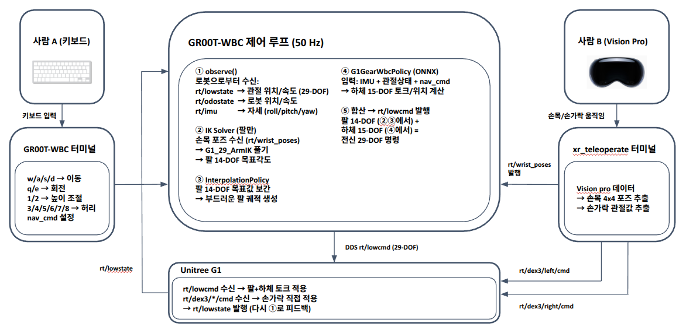

# g1_xr_locomotion

Unitree G1 전신 텔레오퍼레이션: XR로 팔/손 제어, GR00T-WBC로 하체 제어.

이 프로젝트는 **[xr_teleoperate](https://github.com/unitreerobotics/xr_teleoperate)**(XR 기기를 통한 상체 제어)와 **[GR00T-WholeBodyControl](https://github.com/NVIDIA-Omniverse/GR00T-WholeBodyControl)**(WBC 정책을 통한 하체 보행/밸런스)을 통합하여 **Isaac Sim** 환경에서 Unitree G1 휴머노이드 로봇의 전신 텔레오퍼레이션을 구현합니다.

- **상체** (팔 + 손): Apple Vision Pro 핸드 트래킹을 통한 실시간 제어
- **하체** (다리 + 허리): NVIDIA GR00T Whole-Body-Control 정책 + 키보드 보행 명령
- **통신**: 3개 프로세스가 DDS(CycloneDDS)를 통해 조율, 양쪽 프로젝트의 핵심 로직 수정 없음

---

## 목차

1. [아키텍처 개요](#1-아키텍처-개요)
2. [사전 요구사항](#2-사전-요구사항)
3. [설치](#3-설치)
4. [시뮬레이션 배포](#4-시뮬레이션-배포)
5. [실제 로봇 배포](#5-실제-로봇-배포)
6. [음성 제어](#6-음성-제어)
7. [데이터 녹화](#7-데이터-녹화)
8. [기술 상세](#8-기술-상세)
9. [레포지토리 구조](#9-레포지토리-구조)
10. [감사의 글](#10-감사의-글)

---

## 1. 아키텍처 개요

시스템은 DDS를 통해 통신하는 **3개의 독립 프로세스**로 실행됩니다:



| 프로세스 | Conda 환경 | 역할 | 제어 대상 |
|----------|-----------|------|----------|
| Isaac Sim | `unitree_sim_env` | 물리 시뮬레이션, 카메라 스트리밍 | 로봇 시뮬레이션 (PhysX) |
| GR00T-WBC | `gr00t_wbc_env` | 전신 보행 + 밸런스 | 다리 (12 DOF) + 허리 (3 DOF) + 팔 (14 DOF) |
| xr_teleoperate | `tv` | XR 핸드 트래킹, 팔 IK, 손 리타겟팅 | 팔 (14 DOF) + 손 (14 DOF) |

---

## 2. 사전 요구사항

### 하드웨어
- **GPU**: NVIDIA RTX GPU (Isaac Sim용, [시스템 요구사항](https://docs.isaacsim.omniverse.nvidia.com/4.5.0/installation/requirements.html) 참조)
- **XR 기기**: Apple Vision Pro, Meta Quest 3, 또는 PICO 4 Ultra Enterprise
- **라우터**: XR 기기와 호스트 PC를 동일 네트워크에 연결

### 소프트웨어
- Ubuntu 22.04 (권장) 또는 20.04
- [Miniconda](https://docs.conda.io/en/latest/miniconda.html) 또는 Anaconda
- NVIDIA Isaac Sim 4.5.0 ([Isaac Lab](https://isaac-sim.github.io/IsaacLab/main/source/setup/installation/index.html) 통해 설치)
- Git

### 추가 시스템 패키지

```bash
# 실제 로봇 배포에 필요 (DDS 포트 포워딩)
sudo apt install socat

# 음성 제어에 필요 (오디오 파이프라인)
sudo apt install ffmpeg portaudio19-dev

# GR00T-WBC 실제 로봇 / 음성 제어에 필요
# ROS 2 Humble 설치: https://docs.ros.org/en/humble/Installation/Ubuntu-Install-Debs.html
```

---

## 3. 설치

### 3.1 레포지토리 클론

```bash
git clone https://github.com/Kantapia0814/g1_xr_locomotion.git
cd g1_xr_locomotion
```

### 3.2 셋업 스크립트 실행

셋업 스크립트가 [우리의 Fork](https://github.com/Kantapia0814/unitree_sim_isaaclab)에서 `unitree_sim_isaaclab`을 클론하고 (통합 수정사항이 이미 포함됨), conda 환경을 생성합니다:

```bash
chmod +x setup.sh
./setup.sh
```

> **참고**: `unitree_sim_isaaclab`은 Isaac Lab이 먼저 설치되어야 합니다. [unitree_sim_isaaclab README](https://github.com/unitreerobotics/unitree_sim_isaaclab)를 참조하세요.

### 3.3 Conda 환경 생성 및 패키지 설치

`setup.sh` 스크립트가 `envs/*.yml` 파일에서 자동으로 conda 환경을 생성합니다. 수동으로 생성하려면:

```bash
conda env create -f envs/unitree_sim_env.yml
conda env create -f envs/gr00t_wbc_env.yml
conda env create -f envs/tv.yml
```

환경 생성 후, editable 패키지를 설치합니다:

#### 환경 1: Isaac Sim (`unitree_sim_env`)

```bash
conda activate unitree_sim_env
# Isaac Lab 먼저 설치 (unitree_sim_isaaclab README 참조)
cd unitree_sdk2_python
pip install -e .
```

#### 환경 2: GR00T-WBC (`gr00t_wbc_env`)

```bash
conda activate gr00t_wbc_env
cd GR00T-WholeBodyControl
pip install -e .
cd ../unitree_sdk2_python
pip install -e .

# 음성 제어 의존성 (선택사항 — --voice 플래그 사용 시 필요)
pip install edge-tts faster-whisper openwakeword pyaudio transformers
```

#### 환경 3: xr_teleoperate (`tv`)

```bash
conda activate tv

cd xr_teleoperate/teleop/teleimager
pip install -e . --no-deps

cd ../televuer
pip install -e .

# SSL 인증서 생성 (XR 기기 연결에 필요)
# Pico / Quest의 경우:
openssl req -x509 -nodes -days 365 -newkey rsa:2048 -keyout key.pem -out cert.pem

# Apple Vision Pro의 경우 (상세 설정):
openssl genrsa -out rootCA.key 2048
openssl req -x509 -new -nodes -key rootCA.key -sha256 -days 365 -out rootCA.pem -subj "/CN=xr-teleoperate"
openssl genrsa -out key.pem 2048
openssl req -new -key key.pem -out server.csr -subj "/CN=localhost"
# server_ext.cnf 생성 — IP를 본인 환경에 맞게 변경
cat > server_ext.cnf << 'CERTEOF'
subjectAltName = @alt_names
[alt_names]
DNS.1 = localhost
IP.1 = 192.168.123.164
IP.2 = <YOUR_HOST_IP>
CERTEOF
# IP.1 = 로봇 PC2 내부 IP (192.168.123.164, Unitree 고정값)
# IP.2 = XR 기기가 접속하는 네트워크의 호스트 PC IP
openssl x509 -req -in server.csr -CA rootCA.pem -CAkey rootCA.key \
  -CAcreateserial -out cert.pem -days 365 -sha256 -extfile server_ext.cnf
# rootCA.pem을 Apple Vision Pro에 AirDrop으로 전송 후 설치

# 인증서 경로 설정
mkdir -p ~/.config/xr_teleoperate/
cp cert.pem key.pem ~/.config/xr_teleoperate/

# dex-retargeting 설치
cd ../robot_control/dex-retargeting
pip install -e .

# 나머지 의존성 설치
cd ../../../
pip install -r requirements.txt

# unitree_sdk2_python 설치
cd ../unitree_sdk2_python
pip install -e .
```

---

## 4. 시뮬레이션 배포

### 4.1 실행 순서

3개 프로세스를 **순서대로** 실행해야 합니다. 3개의 별도 터미널을 열어주세요:

#### 터미널 1: Isaac Sim

```bash
conda activate unitree_sim_env
cd unitree_sim_isaaclab

python sim_main.py \
  --task=Isaac-MinimalGround-G129-Dex3-Wholebody \
  --enable_fullbody_dds \
  --enable_cameras \
  --enable_dex3_dds \
  --device cpu \
  --robot_type g129
```

시뮬레이션 창이 나타나고 `controller started, start main loop...`이 출력될 때까지 기다리세요.

> **참고**: 시뮬레이션 창을 한 번 클릭하여 활성화하세요.

#### 터미널 2: GR00T-WBC

```bash
conda activate gr00t_wbc_env
cd GR00T-WholeBodyControl

python -m gr00t_wbc.control.main.teleop.run_g1_xr_control_loop
```

`Waiting for arm commands on rt/arm_sdk from xr_teleoperate...`가 출력될 때까지 기다리세요.

**보행 키보드 조작:**

| 키 | 동작 |
|---|------|
| `]` | WBC 정책 활성화 (밸런스 시작) |
| `o` | 정책 비활성화 |
| `w` / `s` | 전진 / 후진 |
| `a` / `d` | 좌/우 이동 |
| `q` / `e` | 좌/우 회전 |

#### 터미널 3: xr_teleoperate

```bash
conda activate tv
cd xr_teleoperate/teleop

python teleop_hand_and_arm.py \
  --sim \
  --arm=G1_29 \
  --ee=dex3 \
  --img-server-ip=localhost
```

> **중요**: 시뮬레이션 모드에서는 `--img-server-ip=localhost`를 사용하세요.

### 4.2 XR 기기 연결

1. XR 헤드셋을 착용하고 호스트 PC와 동일한 Wi-Fi 네트워크에 연결
2. 브라우저를 열고 다음 주소로 이동: `https://<HOST_IP>:8012?ws=wss://<HOST_IP>:8012`
   - `<HOST_IP>`를 호스트 머신의 IP로 변경 (`ifconfig`으로 확인)
   - SSL 인증서 경고가 나오면 수락
3. **Virtual Reality** 클릭 후 모든 프롬프트 허용
4. 팔을 로봇의 초기 포즈에 맞춤 (양팔을 몸 옆으로)
5. 터미널 3에서 **`r`** 키를 눌러 텔레오퍼레이션 시작

### 4.3 추가 옵션

```bash
# 데이터 녹화 포함
python teleop_hand_and_arm.py --sim --arm=G1_29 --ee=dex3 --img-server-ip=localhost --record

# 컨트롤러 트래킹 (핸드 트래킹 대신)
python teleop_hand_and_arm.py --sim --arm=G1_29 --ee=dex3 --img-server-ip=localhost --input-mode=controller

# 헤드리스 모드 (xr_teleoperate 측 GUI 없음)
python teleop_hand_and_arm.py --sim --arm=G1_29 --ee=dex3 --img-server-ip=localhost --headless
```

### 4.4 종료

1. 로봇의 팔을 초기 포즈에 가깝게 위치
2. 터미널 3 (xr_teleoperate)에서 **`q`** 입력
3. 터미널 2 (GR00T-WBC)에서 `Ctrl+C`
4. Isaac Sim 종료

---

## 5. 실제 로봇 배포

> **참고**: 아래 명령어에서 `~/g1_xr_locomotion`은 레포지토리 클론 경로입니다. 실제 경로에 맞게 변경하세요.

실제 배포는 동일한 3-프로세스 아키텍처를 따르되, 다음 차이점이 있습니다:

### 5.1 이미지 서비스 (로봇 PC2에서)

로봇의 개발 컴퓨팅 유닛(PC2)에 SSH로 접속하여 이미지 서버를 실행합니다:

```bash
ssh unitree@192.168.123.164
# 비밀번호: 123  →  Enter (ROS 프롬프트 스킵)

source ~/venvs/teleimager/bin/activate
cd ~/teleimager
teleimager-server --rs
```

> **참고**: `teleimager`는 Unitree G1 개발 컴퓨팅 유닛(PC2)에 사전 설치되어 있습니다. `--rs` 플래그는 RealSense 카메라 지원을 활성화합니다. `--cf`로 연결된 모든 카메라를 확인할 수 있습니다.
>
> **카메라 Busy 오류**: 카메라가 사용 중이라는 오류가 나오면, 태블릿의 **Unitree Explore** 앱 → Device → Service Status → `vidio_hub_pc4/1.0.1.1` 종료

### 5.2 socat 포트 포워딩 (호스트 PC에서)

로봇의 DDS 포트를 호스트 PC로 포워딩합니다:

```bash
sudo socat TCP-LISTEN:60001,fork TCP:192.168.123.164:60001
sudo socat TCP-LISTEN:60000,fork TCP:192.168.123.164:60000
```

### 5.3 실행

#### 터미널 1: GR00T-WBC (호스트 PC에서)

```bash
export LD_LIBRARY_PATH=$CONDA_PREFIX/lib:$LD_LIBRARY_PATH
source /opt/ros/humble/setup.bash
conda activate gr00t_wbc_env
cd ~/g1_xr_locomotion/GR00T-WholeBodyControl

python -m gr00t_wbc.control.main.teleop.run_g1_xr_control_loop \
  --interface real
```

> **팔 안정성**: GR00T-WBC 제어 루프에 팔을 내부 루프로 통합하여 속도 인식 댐핑과 델타 클램핑을 적용합니다. 이를 통해 방향을 바꾸거나 움직일 때 팔이 떨어지거나 튀는 문제를 해결했습니다.

#### 터미널 2: xr_teleoperate (호스트 PC에서)

```bash
conda activate tv
cd ~/g1_xr_locomotion/xr_teleoperate/teleop

python teleop_hand_and_arm.py \
  --arm=G1_29 \
  --ee=dex3 \
  --img-server-ip=<YOUR_HOST_IP> \
  --network-interface=<YOUR_INTERFACE> \
  --motion
```

> **환경별 값** — 실행 전 교체하세요:
> - `<YOUR_HOST_IP>`: XR 기기가 접속 가능한 네트워크의 호스트 PC IP (`ip addr`로 확인). 예: `192.168.1.13`
> - `<YOUR_INTERFACE>`: 로봇에 연결된 네트워크 인터페이스 (`ip -br link show`로 확인). 예: `eno3np0`

> **경고**:
> 1. 항상 로봇으로부터 안전 거리를 유지하세요.
> 2. `--motion` 사용 전 로봇이 제어 모드(R3 리모컨)인지 확인하세요.
> 3. `r` 키를 누르기 전 팔을 초기 포즈에 맞추세요.
> 4. `q` 키를 눌러 종료하기 전 팔을 초기 포즈에 가깝게 위치시키세요.

---

## 6. 음성 제어

음성 명령은 **OpenWakeWord** (웨이크 워드 감지) → **Faster-Whisper** (STT) → **Qwen3-0.6B** (LLM 명령 파싱) → **edge-tts** (로봇 스피커 오디오 피드백) 파이프라인을 사용합니다.

**"hey mycroft"**라고 말하면 활성화되며, 한국어 또는 영어로 명령을 말하세요.

### 6.1 GR00T-WBC 음성 제어 (XR 텔레오퍼레이션 모드)

XR로 팔을 제어하면서 동시에 음성으로 보행을 제어합니다. 이미지 서버(5.1절)와 xr_teleoperate(5.3절)를 평소처럼 실행한 뒤, GR00T-WBC에 `--voice`를 추가합니다:

```bash
export LD_LIBRARY_PATH=$CONDA_PREFIX/lib:$LD_LIBRARY_PATH
source /opt/ros/humble/setup.bash
conda activate gr00t_wbc_env
cd ~/g1_xr_locomotion/GR00T-WholeBodyControl

python -m gr00t_wbc.control.main.teleop.run_g1_xr_control_loop \
  --voice \
  --interface real
```

**사용 가능한 음성 명령 (GR00T-WBC 모드):**

| 한국어 명령 | 영어 명령 | 동작 |
|---|---|---|
| 앞으로 걸어 | walk forward | 전진 |
| 뒤로 가 | walk backward | 후진 |
| 왼쪽으로 가 | walk left | 좌측 이동 |
| 오른쪽으로 가 | walk right | 우측 이동 |
| 왼쪽으로 돌아 | turn left | 좌회전 |
| 오른쪽으로 돌아 | turn right | 우회전 |
| 멈춰 | stop | 정지 |
| 빨리 | faster | 보행 속도 증가 |
| 천천히 | slower | 보행 속도 감소 |
| 높이 | higher | 몸체 높이 올리기 |
| 낮게 | lower | 몸체 높이 내리기 |
| 활성화 | activate | WBC 정책 활성화 |
| 비활성화 | deactivate | WBC 정책 비활성화 |

### 6.2 SDK2 단독 음성 제어 (GR00T-WBC 없이)

Unitree SDK2 내장 동작(이동 + 팔 제스처)으로 로봇을 직접 제어합니다. GR00T-WBC나 Isaac Sim이 필요 없습니다.

**사전 준비**: **Unitree Explore** 태블릿 앱에서 "Go!" 버튼을 누른 후, 순서대로 모드를 변경합니다: **Damping Mode → Preparation Mode → Walk (Control Waist)**.

```bash
source /opt/ros/humble/setup.bash
conda activate gr00t_wbc_env
cd ~/g1_xr_locomotion/xr_teleoperate

python -m teleop.run_voice_sdk2 --interface <YOUR_INTERFACE>
```

> **참고**: `<YOUR_INTERFACE>`를 로봇에 연결된 네트워크 인터페이스로 교체하세요 (`ip -br link show`로 확인, 예: `eno3np0`). 컴퓨터에 연결된 마이크에 "hey mycroft"라고 말하면 **띵** 소리가 들리고, 바로 명령을 내리면 됩니다.

**사용 가능한 음성 명령 (SDK2 모드):**

| 카테고리 | 명령 |
|---|---|
| **이동** | walk (forward/backward/left/right), turn (left/right), stop |
| **자세** | sit, stand up, high stand, low stand, stand to squat, balance stand |
| **팔 제스처** | clap, high five, hug, heart, right heart, hands up, reject, shake hand, wave, high wave, x-ray, two-hand kiss, left kiss, right kiss |

**오디오 피드백**: 웨이크 워드가 감지되면 로봇이 **띵** 소리를 재생합니다. 명령 파싱 후, 동작 실행 전에 로봇 내장 스피커를 통해 **명령 이름을 음성으로 안내**합니다 (예: "high wave").

---

## 7. 데이터 녹화

GR00T-WBC 제어 루프는 모방 학습을 위해 로봇 상태, 행동, 카메라 프레임을 **LeRobot 형식**으로 녹화할 수 있습니다.

### 7.1 녹화 시작

녹화에는 3개 프로세스가 모두 필요합니다: Isaac Sim + GR00T-WBC (`--record`) + xr_teleoperate.

#### 터미널 1: Isaac Sim

```bash
conda activate unitree_sim_env
cd unitree_sim_isaaclab

python sim_main.py \
  --task=Isaac-MinimalGround-G129-Dex3-Wholebody \
  --enable_fullbody_dds \
  --enable_cameras \
  --enable_dex3_dds \
  --device cpu \
  --robot_type g129
```

#### 터미널 2: GR00T-WBC + 녹화

```bash
export LD_LIBRARY_PATH=$CONDA_PREFIX/lib:$LD_LIBRARY_PATH
source /opt/ros/humble/setup.bash
conda activate gr00t_wbc_env
cd ~/g1_xr_locomotion/GR00T-WholeBodyControl

# 카메라 없이
python -m gr00t_wbc.control.main.teleop.run_g1_xr_control_loop \
  --record \
  --interface sim

# 카메라 포함 (teleimager 서버가 실행 중이어야 함)
python -m gr00t_wbc.control.main.teleop.run_g1_xr_control_loop \
  --record \
  --interface sim \
  --img-server-ip 192.168.123.164 \
  --img-server-port 55555

# task 이름 지정 (출력 폴더명에 반영)
python -m gr00t_wbc.control.main.teleop.run_g1_xr_control_loop \
  --record \
  --interface sim \
  --task-name test_move_4
```

#### 터미널 3: xr_teleoperate

```bash
conda activate tv
cd ~/g1_xr_locomotion/xr_teleoperate/teleop

python teleop_hand_and_arm.py \
  --arm=G1_29 \
  --ee=dex3 \
  --img-server-ip=<YOUR_HOST_IP> \
  --network-interface=<YOUR_INTERFACE> \
  --motion
```

### 7.2 녹화 조작

| 키 | 동작 |
|-----|------|
| `c` | 에피소드 녹화 시작 / 중지 (저장) |
| `x` | 현재 에피소드 저장하지 않고 삭제 |

데이터는 `GR00T-WholeBodyControl/outputs/{타임스탬프}-g1-xr-{task_name}/` 경로에 LeRobot 형식으로 저장됩니다.

**녹화 데이터**: 관절 상태 (q, dq), 행동, 엔드이펙터 포즈, 손 명령 (q, kp, kd), 이동 명령 (vx, vy, yaw_rate), 기저 높이, 몸체 방향 (roll, pitch, yaw), 카메라 프레임 (이미지 서버 연결 시).

### 7.3 녹화 데이터 재생

재생은 터미널 2개만 필요합니다 (Isaac Sim + 재생). xr_teleoperate는 불필요합니다.

#### 터미널 1: Isaac Sim (위와 동일)

#### 터미널 2: 재생

```bash
conda activate gr00t_wbc_env
cd ~/g1_xr_locomotion/GR00T-WholeBodyControl

python -m gr00t_wbc.control.main.teleop.run_g1_xr_replay \
  --dataset-path <데이터셋 경로> \
  --episode <에피소드 번호> \
  --interface sim
```

| 옵션 | 설명 |
|------|------|
| `--dataset-path` | LeRobot 데이터셋 디렉토리 경로 |
| `--episode` | 재생할 에피소드 인덱스 (기본값: 0) |
| `--interface` | `sim`은 Isaac Sim, `real`은 실제 로봇 |
| `--playback-speed` | 재생 속도 배율 (기본값: 1.0) |
| `--loop` | 에피소드 반복 재생 |

재생은 3단계로 진행됩니다: 안정화 (RL 밸런스 활성화), 워밍업 (팔이 첫 프레임으로 보간), 재생 (데이터의 팔 동작 + RL 밸런스로 다리 + 녹화된 이동 명령).
---

## 8. 기술 상세

### 8.1 GR00T-WBC의 Sim-to-Sim 마이그레이션

GR00T-WholeBodyControl은 원래 자체 **MuJoCo** 시뮬레이터와 함께 실행되도록 설계되었습니다. 우리는 WBC 정책 로직을 보존하면서 MuJoCo를 Isaac Sim으로 대체하는 **sim-to-sim 마이그레이션**을 수행했습니다.

**해결 방법: External Simulator 모드**

새로운 컨트롤 루프(`run_g1_xr_control_loop.py`)를 생성하여 `SIMULATOR = "external"`로 설정, MuJoCo 인스턴스화를 방지합니다. `G1Env`는 실제 로봇과 동일하게 DDS를 통해 Isaac Sim과 통신합니다.

Isaac Sim은 `rt/lowcmd`를 수신하고 내부적으로 임피던스 제어 토크를 계산합니다:

```
torque = tau + kp * (q_target - q_current) + kd * (dq_target - dq_current)
```

**Isaac Sim 추가 수정사항** ([우리의 Fork](https://github.com/Kantapia0814/unitree_sim_isaaclab)):
- `action_provider_wh_dds.py`: MuJoCo 액추에이터 모델에 맞는 전신 토크 제어 모드
- `odo_imu_dds.py`: `rt/odostate` 및 `rt/secondary_imu`용 새 DDS 퍼블리셔
- `g1_29dof_state.py`: GR00T-WBC용 floating-base odometry 및 torso IMU 발행
- `unitree.py`: MuJoCo 값에 맞춘 effort 제한 (허리/발목 50 Nm)
- 카메라 지원이 포함된 새 `Isaac-MinimalGround-G129-Dex3-Wholebody` 태스크

### 8.2 DDS 통신 아키텍처

모든 프로세스 간 통신은 **CycloneDDS**, **Domain ID 1** (시뮬레이션 모드)을 사용합니다.

| DDS 토픽 | 메시지 타입 | 발행자 | 구독자 | 내용 |
|-----------|-----------|--------|--------|------|
| `rt/lowstate` | `LowState_` | Isaac Sim | GR00T-WBC, xr_teleoperate | 29-DOF 관절 상태 + IMU |
| `rt/odostate` | `OdoState_` | Isaac Sim | GR00T-WBC | Floating-base odometry |
| `rt/secondary_imu` | `IMUState_` | Isaac Sim | GR00T-WBC | Torso IMU |
| `rt/lowcmd` | `LowCmd_` | GR00T-WBC | Isaac Sim | 29-DOF 몸체 명령 (q, dq, tau, kp, kd) |
| `rt/arm_sdk` | `LowCmd_` | xr_teleoperate | GR00T-WBC | 14 팔 관절 위치 |
| `rt/dex3/left/cmd` | `HandCmd_` | xr_teleoperate | Isaac Sim | 7-DOF 왼손 명령 |
| `rt/dex3/right/cmd` | `HandCmd_` | xr_teleoperate | Isaac Sim | 7-DOF 오른손 명령 |

**Isaac Sim의 이중 제어 모드:**
- **몸체 관절 (29 DOF)**: 토크 제어 (PD 게인 제로, GR00T-WBC 토크 직접 적용)
- **손 관절 (14 DOF)**: 위치 제어 (PD 게인 유지, xr_teleoperate 위치 타겟)

### 8.3 GR00T-WBC 내부 루프 팔 통합

기존 아키텍처에서는 xr_teleoperate의 팔 명령이 외부에서 적용되었습니다. 이로 인해 방향을 바꿀 때 팔이 떨어지거나 튀는 문제가 발생했는데, WBC 정책이 팔 상태에 대한 피드백이 없었기 때문입니다.

**해결책**: 팔을 GR00T-WBC 내부 제어 루프에 통합하여 다음을 적용합니다:
- **델타 클램핑**: 위치 델타를 `MAX_ARM_VELOCITY / control_frequency` (50Hz에서 0.2 rad/step)로 클램핑하여 급격한 점프 방지
- **속도 인식 댐핑**: 실제 관절 속도가 `VELOCITY_DAMPING_START` (3.0 rad/s)를 초과하면, `SAFETY_VELOCITY_LIMIT` (6.0 rad/s)에 근접함에 따라 명령 델타를 점진적으로 0으로 감소

이를 통해 텔레오퍼레이션 중 반응성을 유지하면서 부드럽고 안정적인 팔 동작을 보장합니다.

### 8.4 핵심 통합 과제 및 해결책

**DDS 토픽 충돌 방지**: xr_teleoperate는 팔 명령을 `rt/arm_sdk`로 발행 (`rt/lowcmd`가 아님). GR00T-WBC가 하체 출력과 병합하여 통합 29-DOF 명령을 `rt/lowcmd`로 발행.

**CycloneDDS Fork 안전성**: 손 리타겟팅은 `fork()`을 통한 자식 프로세스에서 실행. CycloneDDS 스레드는 `fork()` 이후 생존하지 않으므로, 메인 프로세스가 공유 메모리에서 읽어 `publish_from_main_process()`를 통해 손 명령을 발행.

**Head Yaw 보상**: VR 헤드셋과 로봇 정면 방향 간 불일치를 보정하기 위해 역 yaw 회전을 손목 위치와 방향에 적용.

**토크 제어 모드에서의 손 명령**: Isaac Sim의 `DDSRLActionProvider`를 수정하여 모든 시뮬레이션 서브스텝에서 몸체 토크 타겟과 함께 손 위치 타겟을 적용.

**GR00T-WBC용 OdoState/IMU**: GR00T-WBC의 `BodyStateProcessor`가 필요로 하는 floating-base odometry 및 torso IMU 데이터를 제공하는 새 `OdoImuDDS` 퍼블리셔 생성.

---

## 9. 레포지토리 구조

```
g1_xr_locomotion/
│
├── README.md                       # 영어 버전
├── README_ko.md                    # 한국어 버전 (이 파일)
├── setup.sh                        # 자동 셋업 (Fork 클론, conda 환경 생성)
├── .gitignore
│
├── envs/                           # Conda 환경 내보내기 파일
│   ├── unitree_sim_env.yml         # Isaac Sim 환경
│   ├── gr00t_wbc_env.yml           # GR00T-WBC 환경
│   └── tv.yml                      # xr_teleoperate 환경
│
├── xr_teleoperate/                 # XR을 통한 상체 제어 (수정됨)
│   ├── assets/                     # 로봇 URDF 파일
│   ├── teleop/
│   │   ├── teleop_hand_and_arm.py  # 메인 스크립트 (수정: 손 DDS 재발행)
│   │   ├── run_voice_sdk2.py       # 신규: SDK2 단독 음성 제어 스크립트
│   │   ├── robot_control/
│   │   │   ├── robot_hand_unitree.py   # (수정: publish_from_main_process)
│   │   │   ├── robot_arm_ik.py
│   │   │   └── robot_arm.py
│   │   ├── televuer/
│   │   │   └── src/televuer/
│   │   │       └── tv_wrapper.py       # (수정: head yaw 보상)
│   │   ├── teleimager/             # 이미지 스트리밍
│   │   └── utils/
│   │       ├── sdk2_voice_controller.py  # 신규: SDK2 음성 컨트롤러
│   │       ├── sdk2_command_schema.py    # 신규: SDK2 LLM 프롬프트 + 파싱
│   │       └── ...                       # 녹화, 필터링, 시각화
│   └── requirements.txt
│
├── GR00T-WholeBodyControl/         # 하체 보행 (수정됨)
│   └── gr00t_wbc/
│       └── control/
│           ├── main/teleop/
│           │   ├── run_g1_xr_control_loop.py   # 신규: XR 컨트롤 루프 (음성 + 녹화)
│           │   └── run_g1_xr_replay.py         # 신규: LeRobot 데이터셋 재생
│           └── utils/
│               ├── voice_controller.py         # 신규: GR00T-WBC 음성 컨트롤러
│               └── text_to_speech.py           # 신규: TTS 유틸리티
│
├── unitree_sdk2_python/            # DDS 통신 라이브러리 (수정됨)
│   └── unitree_sdk2py/idl/
│       ├── default.py              # (수정: OdoState_ 팩토리)
│       └── unitree_hg/msg/dds_/
│           └── _OdoState_.py       # 신규: OdoState IDL 데이터클래스
│
└── unitree_sim_isaaclab/           # setup.sh가 Fork에서 클론
                                    # (https://github.com/Kantapia0814/unitree_sim_isaaclab)
```

---

## 10. 감사의 글

이 프로젝트는 다음 오픈소스 프로젝트를 기반으로 합니다:

- [xr_teleoperate](https://github.com/unitreerobotics/xr_teleoperate) — Unitree XR 텔레오퍼레이션
- [GR00T-WholeBodyControl](https://github.com/NVIDIA-Omniverse/GR00T-WholeBodyControl) — NVIDIA 전신 제어
- [unitree_sim_isaaclab](https://github.com/unitreerobotics/unitree_sim_isaaclab) — Unitree Isaac Lab 시뮬레이션
- [unitree_sdk2_python](https://github.com/unitreerobotics/unitree_sdk2_python) — Unitree Python DDS SDK
- [OpenTeleVision](https://github.com/OpenTeleVision/TeleVision) — 텔레오퍼레이션 프레임워크
- [dex-retargeting](https://github.com/dexsuite/dex-retargeting) — 손 리타겟팅
- [vuer](https://github.com/vuer-ai/vuer) — WebXR 프레임워크
- [pinocchio](https://github.com/stack-of-tasks/pinocchio) — 강체 동역학 라이브러리
